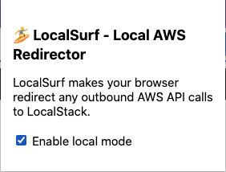
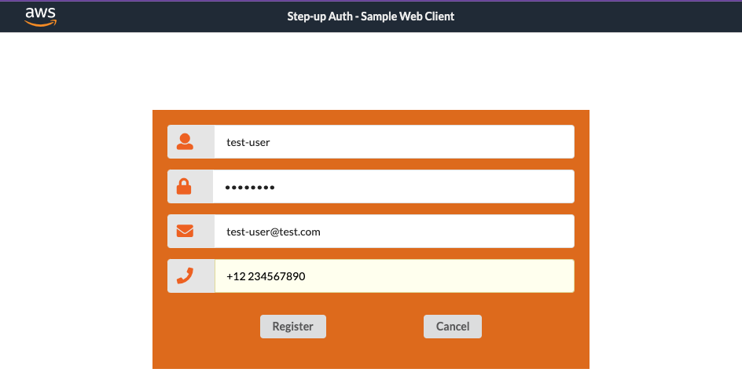
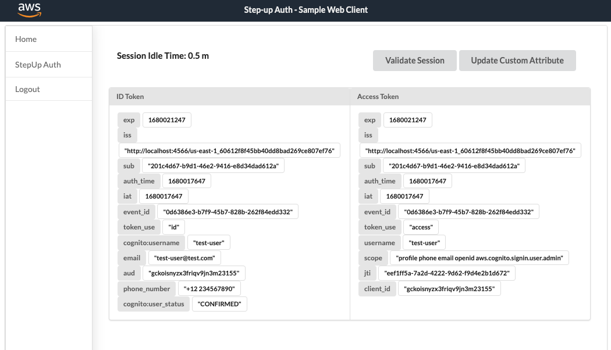
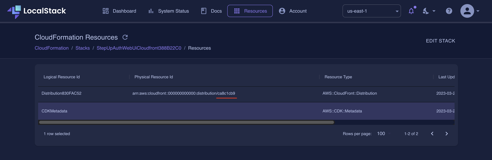

# Step-up Authentication using Amazon Cognito, DynamoDB, API Gateway Lambda Authorizer, and Lambda functions

| Key          | Value                                                                |
| ------------ | -------------------------------------------------------------------- |
| Environment  |                                                                       |
| Services     | Cognito, DynamoDB, API Gateway, Lambda, CloudFront, S3, IAM, Amplify |
| Integrations | CDK, AWS CLI                                                         |
| Categories   | Serverless; Security, Identity, and Compliance                       |
| Level        | Advanced                                                             |
| GitHub       | [Repository link](https://github.com/localstack/step-up-auth-sample) |

## Introduction

The Step-up Authentication sample using Cognito, DynamoDB, API Gateway Lambda Authorizer, and Lambda functions demonstrates how to build and launch a Step-up workflow engine with an API Serving Layer on your local machine. This application sample uses Cognito as an identity provider, API Gateway with Authorizer Lambda function to trigger the Step-up workflow engine, and DynamoDB Service as the persistent layer the Step-up workflow Engine uses. The application client is implemented using ReactJS and Amplify, which allows us to invoke a privileged API and go through Step-up authentication. With the LocalSurf browser plugin, you can test the application on your local machine by making API requests to LocalStack instead of AWS to allow you to use the production code locally without changes. Refer to the [official AWS blogs](#learn-more) for additional design documentation and implementation details.

## Architecture diagram

The following diagram shows the architecture that this sample application builds and deploys:


We are using the following AWS services and their features to build our infrastructure:

- [Cognito User Pools](https://docs.localstack.cloud/user-guide/aws/cognito/) used as user registry and an identity provider for user authentication.
- [API Gateway](https://docs.localstack.cloud/user-guide/aws/apigatewayv2/) to trigger the Step-up workflow engine for the Lambda Authorizer.
- [DynamoDB](https://docs.localstack.cloud/user-guide/aws/dynamodb/) as a key-value and document database to persist data used by Step-up workflow Engine.
- [IAM](https://docs.localstack.cloud/user-guide/aws/iam/) to create policies to specify roles and permissions for various AWS services.
- [CloudFront](https://docs.localstack.cloud/user-guide/aws/cloudfront/) to create a local CloudFront distribution for the application accessible via CloudFront URLs.
- [Lambda](https://docs.localstack.cloud/user-guide/aws/lambda/) to create an Authorizer Lambda function to trigger the Step-up workflow engine.
- [S3](https://docs.localstack.cloud/user-guide/aws/s3/) to deploy the Amplify web application via CloudFront distribution on a locally accessible CloudFront URL.
- [Amplify](https://docs.localstack.cloud/user-guide/aws/amplify/) to create a web application that uses the Step-up workflow engine to authenticate users. 

## Prerequisites

- LocalStack Pro
- [LocalSurf](https://docs.localstack.cloud/user-guide/tools/localsurf/) to repoint AWS service calls to LocalStack.
- [AWS CLI](https://docs.localstack.cloud/user-guide/integrations/aws-cli/) with the `awslocal` wrapper.
- [CDK](https://docs.localstack.cloud/user-guide/integrations/aws-cdk/) with the `cdklocal` wrapper.
- [NodeJS v18.0.0](https://nodejs.org/en/download/) with `npm` package manager.

Start LocalStack Pro with the appropriate configuration to enable the S3 website to send requests to the container APIs:

```bash
export LOCALSTACK_API_KEY=<your-api-key>
```
Then run:

```bash
EXTRA_CORS_ALLOWED_ORIGINS=* localstack start -d
```

The `EXTRA_CORS_ALLOWED_ORIGINS` configuration variable allows our website to send requests through the Amplify Web Application to the privileged API to enable us to demonstrate step-up authentication.

## Instructions

You can build and deploy the sample application on LocalStack by running our `Makefile` commands. It abstracts the steps required to build and deploy the application, which are mentioned in detail in the `build.sh` and `deploy-local.sh` script, present in the `deployment` directory.

### Building the resources

To build the resources, run the following command:

```shell
make build
```

This command runs the `build.sh` script, which packages the Lambda functions which would be part of the Step-up workflow Engine. The following Lambda functions are packaged:

- [Step-up authorizer](source/step-up-authorizer/)
- [Step-up Challenge](source/step-up-challenge/)
- [Step-up Initiate](source/step-up-initiate/)
- [Sample API Lambda](source/sample-api/)

Apart from this, the Amplify Web Application is also built and packaged to be deployed on the CloudFront distribution via an S3 bucket.

### Deploying the resources

To deploy the resources, run the following command:

```shell
make deploy
```

The command bootstraps the CDK deployment and creates the local AWS resources using LocalStack. The output from the command will contain a local CloudFront distribution URL:

```shell
Copying dist contents to Web UI S3 bucket: step-up-auth-web-ui-000000000000-us-east-1
Invalidating cloudfront distribution cache: <DISTRIBUTION-ID>
Done!

Sample Web App URL: <DISTRIBUTION-ID>.cloudfront.localhost.localstack.cloud
```

To access the web application, copy and paste the CloudFront distribution URL in your browser. You will be redirected to the Cognito User Pool sign-in page. You can sign up for a new user and get started with the application.

### Testing the application

To run the application, we need the [LocalSurf](https://docs.localstack.cloud/user-guide/tools/localsurf/) browser plugin installed and enabled. Ideally, your applications should use configuration files to specify their AWS services. However, we inherited hard-coded AWS service endpoints in this sample application, which we need to repoint to LocalStack. We can do this using the LocalSurf browser plugin.



Your application's landing page contains a sing in form. To sign in, you need to have a user account. You can create a new user account by clicking the **Register** button.

To test the web application, open your application URL in your browser that was displayed on the terminal. Enter your username, password, email address, and phone number in the form displayed on the application.



Click on the **Register** button. Cognito will generate a verification code, which will be displayed in the terminal in the LocalStack logs. Use this code to confirm your Account. 

Once you have confirmed your Account, you can sign in to the application with your username and password. You should see your session's information on the landing page.



### Cloud Pods

[Cloud Pods](https://docs.localstack.cloud/user-guide/tools/cloud-pods/) are a mechanism that allows you to take a snapshot of the state in your current LocalStack instance, persist it to a storage backend, and easily share it with your team members.

To save your local AWS infrastructure state using Cloud Pods, you can use the `save` command with a desired name for your Cloud Pod as the first argument:

```bash
localstack pod save step-up-auth-pod
```

You can alternatively use the `save` command with a local file path as the first argument to save the Cloud Pod on your local file system and not the LocalStack Web Application:

```bash
localstack pod save file://<path_to_disk>/step-up-auth-pod
```

The above command will create a zip file named `step-up-auth-pod` to the specified location on the disk.

The `load` command is the inverse operation of the `save` command. It retrieves the content of a previously stored Cloud Pod from the local file system or the LocalStack Web Application and injects it into the application runtime. On an alternate machine, start LocalStack with the API key configured, and pull the Cloud Pod we created previously using the `load` command with the Cloud Pod name as the first argument:

```bash
localstack pod load step-up-auth-pod
```

Alternatively, you can use load the Cloud Pod with the local file path as the first argument:

```bash
localstack pod load file://<path_to_disk>/step-up-auth-pod
```

To ensure everything is set in place, follow the previous steps of setting the configuration variables and query the application URL. The state will be restored, and you should be able to see the same data as before.

To navigate to your application, fetch the CloudFront Distribution URL from [LocalStack Web Application](https://app.localstack.cloud). Navigate to the [CloudFormation Resource Browser](https://app.localstack.cloud/resources/cloudformation/stacks) and click on **StepUpAuthWebUiCloudfront**. Your Distribution ID will be at the end of the ARN:



Copy the distribution ID and paste it in the URL: **https://<DISTRIBUTION_ID>.cloudfront.localhost.localstack.cloud**.

## Learn more

The sample application is based on a [public AWS sample app](https://github.com/aws-samples/step-up-auth) that deploys a Step-up workflow engine on AWS. See these AWS blog posts for more details: 

- [Implement step-up authentication with Amazon Cognito, Part 1: Solution overview](https://aws.amazon.com/blogs/security/implement-step-up-authentication-with-amazon-cognito-part-1-solution-overview/)
- [Implement step-up authentication with Amazon Cognito, Part 2: Deploy and test the solution](https://aws.amazon.com/blogs/security/implement-step-up-authentication-with-amazon-cognito-part-2-deploy-and-test-the-solution/)
